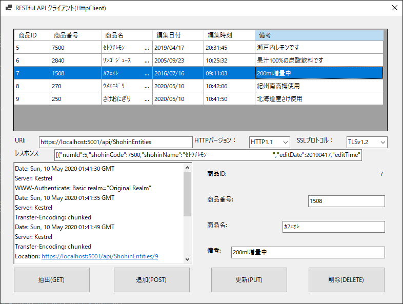
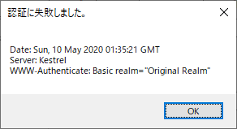

### :computer: JSON形式でHTTPS通信するRESTクライアント(WindowsForms)
___
#### 環境
```
開発環境：Microsoft Visual Studio 2019 Community Edition 16.9.5  
言語：C#.NET 9.0  
フレームワーク：.NET 5.0.6  
デベロッパーパック：.NET SDK 5.0.203  
デスクトップ：Windows Forms  
NuGetライブラリー：Microsoft.Extensions.DependencyInjection 5.0.1  
                   Microsoft.Extensions.Http 5.0.0  

```

#### 画面イメージ  
  

#### 認証画面  
  

#### 認証失敗時  
  